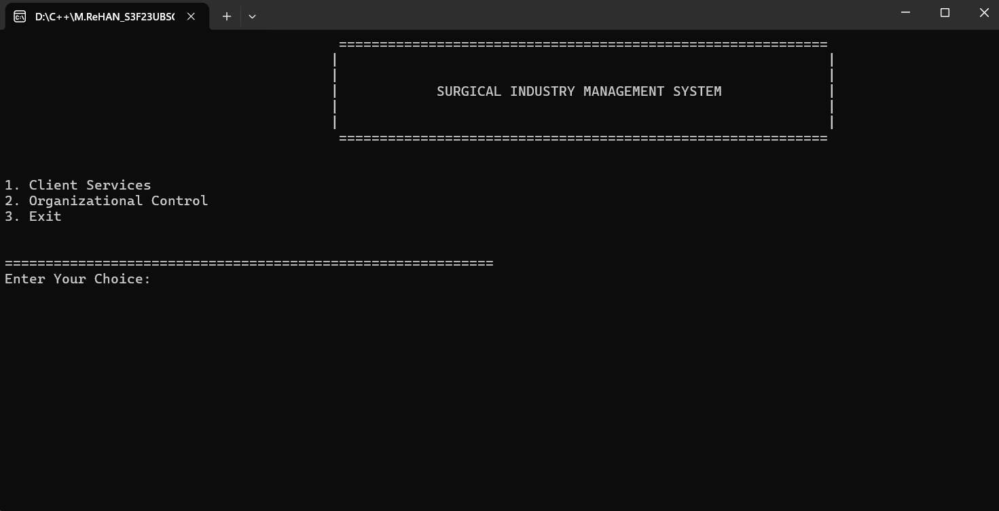
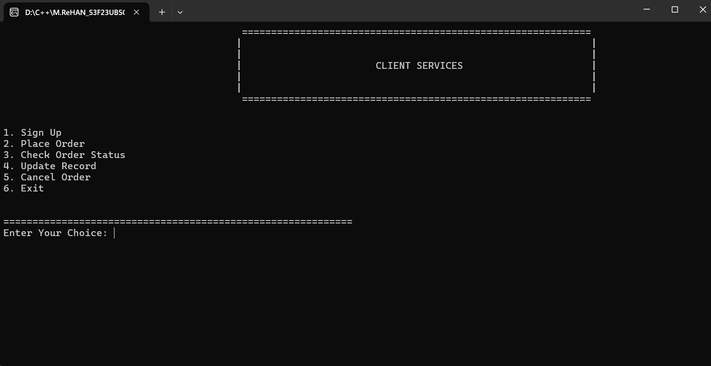

<div align="center">

# 🩺⚙️ Surgical Industry Management System

### A C++ Console-Based Workflow & Order Management System


<br>


<br>

> **A menu-driven C++ application that simulates client management, order processing, production workflow tracking, persistent file storage, and final product release reporting for a surgical manufacturing organization.**

**Originally developed in 2024 as a Programming Fundamentals project at UCP.**

</div>

---

## 📌 Project Overview

The **Surgical Industry Management System** is a console-based C++ application designed to simulate the workflow of a surgical manufacturing organization.

The project combines core programming fundamentals into a complete management workflow where clients can register and place product orders, while organizational departments process those orders through multiple production stages.

The system is divided into two main modules:

### 👤 Client Services

Clients can:

- Register in the system
- Receive a unique client ID
- Place product orders
- Update client information
- Update order information
- Check order progress
- Cancel existing orders

### 🏭 Organizational Control

The organization can:

- View current orders
- Process products through production departments
- Track the completion status of each phase
- Generate final reports for completed products

---

## 🔄 Production Workflow

Every product follows a structured manufacturing lifecycle:

```text
CLIENT REGISTRATION
        │
        ▼
   PLACE ORDER
        │
        ▼
   ┌───────────┐
   │ DESIGNING │
   └─────┬─────┘
         │
         ▼
┌──────────────────────┐
│ STRUCTURE EVALUATION │
└──────────┬───────────┘
           │
           ▼
     ┌─────────┐
     │ TESTING │
     └────┬────┘
          │
          ▼
   ┌─────────────┐
   │ MAINTENANCE │
   └──────┬──────┘
          │
          ▼
  ✅ FINAL PRODUCT RELEASE
          │
          ▼
     📄 FINAL REPORT
```

Each stage depends on the completion of the previous stage, creating a sequential production workflow.

---

## ✨ Features

### 👥 Client Management

- Client registration
- Unique client ID validation
- Product order placement
- Order status tracking
- Client information updates
- Order information updates
- Order cancellation
- Linear-search-based client lookup

---

### ⚙️ Order Processing

The organization processes every order through four production stages:

| Stage | Responsibility |
|---|---|
| 🎨 Designing | Initial product designing |
| 🏗️ Structure Evaluation | Product structure processing |
| 🧪 Testing | Product testing and verification |
| 🔧 Maintenance | Final maintenance processing |

The system ensures that each stage follows the correct sequence.

For example:

```text
Testing cannot be completed
        ↓
until Structure Evaluation is complete
        ↓
which requires Designing to be complete
```

---

## 📊 Order Status Tracking

Clients can check the current status of their product.

Each production stage can appear as:

```text
Designing     : Done / Pending
Structure     : Done / Pending
Testing       : Done / Pending
Maintenance   : Done / Pending
```

This provides a basic simulation of a production lifecycle tracking system.

---

## 💾 File Handling

The project uses C++ file streams to preserve information between program executions.

### `clients.txt`

Stores active client and order information including:

```text
Client Name
Client ID
Product Name
Product Type
Quantity
Designing Status
Structure Status
Testing Status
Maintenance Status
```

The application loads existing data when the program starts and saves updated records before termination.

---

## 📄 Final Product Release Report

Once all production stages are completed:

```text
Designing     ✅
Structure     ✅
Testing       ✅
Maintenance   ✅
```

the system generates:

```text
Final_Product_Release_Report.txt
```

The report contains:

- Client information
- Product information
- Product quantity
- Designing department information
- Structure department information
- Testing department information
- Maintenance department information

The completed order is then removed from the active workflow.

---

## 🖥️ Console Preview

### Main Interface & Client Services

<p align="center">
  
</p>

### Order Processing & Organizational Workflow

<p align="center">
  
</p>

---

## 🧠 Programming Concepts Practiced

This project was developed while learning **Programming Fundamentals** and combines several core C++ concepts into one complete application.

### Core Concepts

```text
✓ Variables & Data Types
✓ Conditional Statements
✓ Loops
✓ Functions
✓ Structures
✓ Arrays
✓ Pointers
✓ Strings
✓ Input / Output Streams
```

### Additional Concepts

```text
✓ File Handling
✓ Linear Search
✓ Data Validation
✓ Unique ID Checking
✓ Record Management
✓ Menu-Driven Programming
✓ Sequential Workflow Logic
✓ String Streams
✓ Formatted Console Output
```

---

## 🛠️ Tech Stack

| Technology | Purpose |
|---|---|
| **C++** | Core application development |
| **C++ Standard Library** | Data processing and utilities |
| **fstream** | Persistent file storage |
| **sstream** | Reading and parsing records |
| **iomanip** | Formatted console output |
| **CLI** | User interface |
| **Windows Console** | Original execution environment |

---

## 📂 Project Structure

```text
surgical-industry-management-system/
│
├── main.cpp
├── clients.txt
├── Final_Product_Release_Report.txt
├── ss1.png
├── ss2.png
└── README.md
```

---

## 🚀 Getting Started

### 1. Clone the Repository

```bash
git clone https://github.com/builtbyrehan/surgical-industry-management-system.git
```

### 2. Navigate to the Project

```bash
cd surgical-industry-management-system
```

### 3. Compile the Program

Using `g++`:

```bash
g++ main.cpp -o surgical-management
```

### 4. Run the Program

On Windows:

```bash
surgical-management.exe
```

---

## 🧭 Main Menu

```text
============================================================

            SURGICAL INDUSTRY MANAGEMENT SYSTEM

============================================================

1. Client Services
2. Organizational Control
3. Exit
```

---

## 👤 Client Services Menu

```text
1. Sign Up
2. Place Order
3. Check Order Status
4. Update Record
5. Cancel Order
6. Exit
```

---

## 🏭 Organizational Control

```text
1. View All Orders
2. Order Processing
3. Back to Main Menu
```

---

## ⚙️ Order Processing

```text
1. Designing Phase
2. Structure Phase
3. Testing Phase
4. Maintenance Phase
5. Exit
```

---

## 🧪 Example System Flow

```text
Client Signs Up
       ↓
Receives Unique ID
       ↓
Places Product Order
       ↓
Designing Department
       ↓
Structure Department
       ↓
Testing Department
       ↓
Maintenance Department
       ↓
Product Completed
       ↓
Final Release Report Generated
```

---

## ⚠️ Project Scope

This project was developed during the early stage of my programming journey and reflects the concepts covered in a **Programming Fundamentals** course.

The original implementation uses:

- Fixed-size arrays
- Structures
- Procedural programming
- Plain-text file storage
- Console-based interaction
- Windows-specific console commands

It is preserved as a representation of my early programming work and progression as a developer.

---

## 🔮 Potential Improvements

If rebuilt using modern C++, the system could be improved with:

- Object-Oriented Programming
- `std::vector` instead of fixed-size arrays
- Classes for clients, orders, and employees
- Separate `.h` and `.cpp` files
- Better input validation
- Exception handling
- Unit testing
- Database integration
- Authentication
- Role-based access control
- Modern CLI interface
- GUI or web-based frontend
- Cross-platform support

---

## 🎯 What I Learned

This project helped me understand how individual programming concepts can work together to build a complete application.

Instead of implementing isolated exercises, the project required combining:

```text
Structures
   +
Arrays
   +
Functions
   +
Searching
   +
Validation
   +
File Handling
   +
Control Flow
   ↓
A Complete Management System
```

It was one of my early experiences building a larger program with multiple interacting features and persistent workflow management.

---

<div align="center">

## 👨‍💻 Built by builtbyrehan

**Programming Fundamentals Project • 2024**

[](https://github.com/builtbyrehan)

### From fundamentals to building real systems. 🚀

</div>